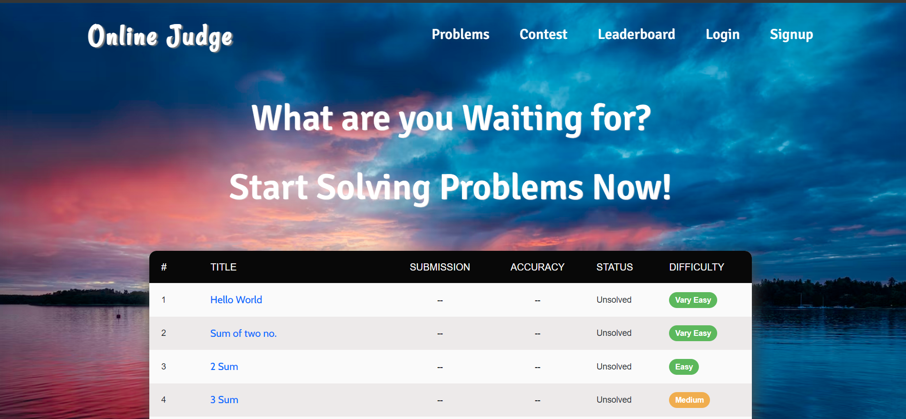

# Online_Judge&nbsp;&nbsp;&nbsp;&nbsp;

Welcome to the Online Judge, a powerful platform designed to evaluate and assess programming skills through a systematic and automated process. This application serves as a hub for coding challenges, algorithmic problem-solving, and competitive programming exercises.



## Key Fretures

- **Dynamic Coding Challenges:** Access a diverse range of coding challenges directly from the website. Users can explore problem statements tailored for various skill levels.

- **Seamless Code Submission:** Submit code effortlessly through a user-friendly interface. The platform supports Create, Read, Update, and Delete (CRUD) operations for managing code submissions.

- **Intuitive User Interface:** Enjoy a visually appealing and intuitive user interface crafted with HTML, CSS, JavaScript, and Bootstrap. The design enhances the overall user experience, making navigation and interaction smooth and enjoyable.

- **Secure Code Execution:** Code submissions are executed within secure Docker Containers, ensuring a protected environment for code execution. This implementation prioritizes security and prevents unauthorized access or interference.

- **Efficient Deployment on AWS EC2:** Deployed on AWS EC2 for reliability and scalability. The project utilizes Gunicorn as the HTTP server and Apache2 as a reverse proxy, enhancing performance and accessibility for users on my custom domain.


## Prerequisites

Before you begin, make sure you have the following installed:

- Python
- Git
- Docker

## Getting Started

Follow these steps to set up the project:

1. **Clone the Repository:**

   ```bash
   git clone https://github.com/Arunnn26/Online_Judge.git
   cd Online_Judge
   ```

2. **Create and Activate Virtual Environment:**

    Windows:
    ```bash
    python -m venv venv
    .\venv\Scripts\activate
    ```

    MacOs:  
    ```bash
    python3 -m venv venv
    source venv/bin/activate  
    ```

3. **Install Dependencies:**
    
    ```bash
    pip install -r requirements.txt
    ```

5. **Database Migration:**
    
    ```bash
    python manage.py makemigrations
    python manage.py migrate
    ```

6. **Run the Application**

    ```bash
    python manage.py runverver
    ```
    This command starts the application and its dependencies
    The application should now be running at http://localhost:8000/. You can access the Django admin panel at    
    http://localhost:8000/admin/

7. **Create Super Creadnetials**
    
    ```bash
    python manage.py createsuperuser
    ```

## Additional Notes

- This README assumes a Windos-based system. If you're using MacOs, some commands may differ.

- Before running the application, it's important to ensure that Docker is installed and configured correctly on 
  your system. Follow these steps to check your Docker installation:

  Open a terminal or command prompt and execute the following command:

    ```bash
    docker --version
    ```

- For certain operations, the project may utilize the `subprocess` module. Ensure that your system allows subprocess execution.

- In some cases, you may need to use `sudo` with Docker commands. Please verify that the `sudo` command is allowed on your machine. If not, consider adjusting your Docker configuration.

- For Docker-related operations, the provided commands assume that the user has the necessary permissions to execute Docker commands. If you encounter issues related to permissions, ensure that your user is part of the Docker group or has the appropriate privileges.

Feel free to adapt the above notes based on the specifics of your project and the potential challenges users might face during setup.